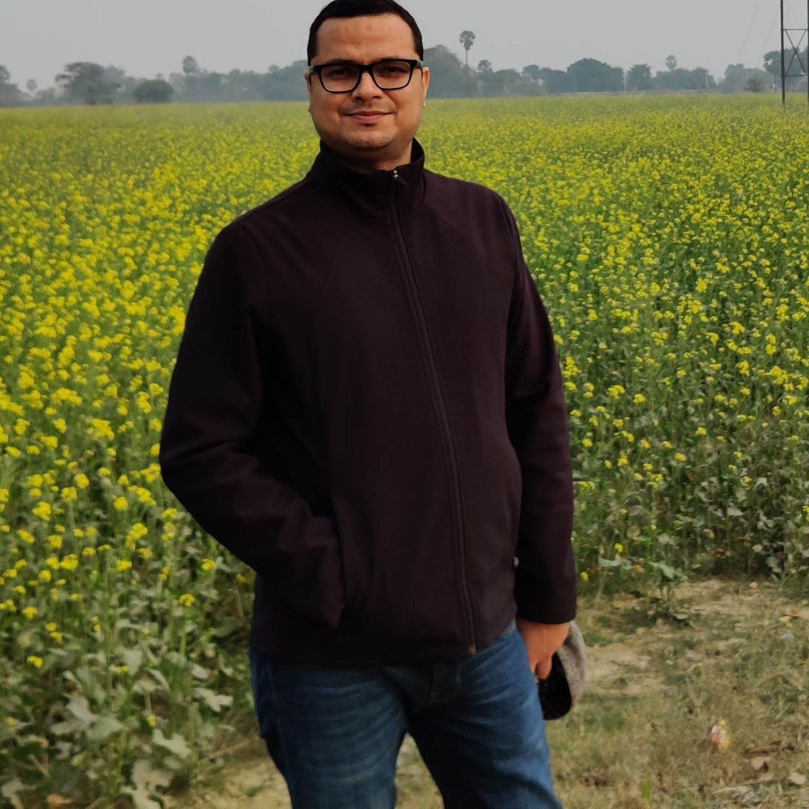

```{r}
#| label: orcid
#| message: false
#| warning: false
#| include: false

#load required libraries
library(httr2)
library(jsonlite)
library(readxl)
library(tidyverse)
library(rvest)

#define orcid id
orcid_id <- "0000-0002-4110-0943"

#read Auth keys
keys <- read_xlsx("./api/api.xlsx")
# id <- as.character(keys[1,1])
# secret <- as.character(keys[1,2])

# Define ORCID API endpoint
url <- paste0("https://pub.orcid.org/v3.0/", orcid_id, "/works")

# client <- oauth_client(
#   id = id,
#   secret = secret,
#   token_url = "https://orcid.org/oauth/authorize",
#   name = "ankur_webpage"
# )


response <- request(url) |> req_headers(accept = "application/json") |>  req_perform()
response
content <- resp_body_json(response)

#extracting put codes of all the works
put_codes <- map(content[["group"]], function(x) x[["work-summary"]][[1]][["put-code"]])
pv <- unlist(put_codes)

#getting response of all the works individually
individual_responses <- function(x){
  url <- paste0("https://pub.orcid.org/v3.0/", orcid_id, "/work/", x)
  response <- request(url) |> req_headers(accept = "application/json") |> req_perform()
  content <- resp_body_json(response)
  return(content)
}

responses <- map(put_codes, individual_responses)

#getting the titles one by one

titles <- map_chr(responses, ~ .x[["title"]][["title"]][["value"]])
pub_year <- map_chr(responses, ~ .x[["publication-date"]][["year"]][["value"]])
journal <- map_chr(responses, ~ .x[["journal-title"]][["value"]])

#get all the authors
authors <- map_chr(responses, ~ {
  authors_list <- .x[["contributors"]][["contributor"]]
  
  if (is.null(authors_list) || length(authors_list) == 0) {
    return("Ankur Jamwal")
  }
  
  # Combine all author names into a single string separated by commas
  author_names <- map_chr(authors_list, ~ .x[["credit-name"]][["value"]])
  paste(author_names, collapse = ", ")
})

#get the urls of all the works
doi <- map_chr(responses, ~{
  doi_url <- .x[["url"]][["value"]]
})

# Combine all the extracted information into a data frame
df <- data.frame(
  Title = titles,
  Year = pub_year,
  Journal = journal,
  DOI = doi,
  Authors = authors,
  stringsAsFactors = FALSE
)

total_papers <- nrow(df)

selected_pub <- head(df, 10) #selecting the first 10 publications

# unite them all
final <- selected_pub |> unite(col = "Publications",
             Title, Year, Authors, Journal, DOI,
             sep = ", ") |> 
  mutate(Publications = str_replace_all(Publications, "\\s+", " ")) |> #remove extra spaces
  mutate(Publications = str_trim(Publications)) |> #remove leading and trailing spaces
  rbind("Source = ORCID")

#get total citations and h-index from Google scholar
gscholar <- "https://scholar.google.com/citations?user=ttKftqkAAAAJ&hl=en"
hindex <- read_html(gscholar) |> 
  html_elements("tr:nth-child(2) .gsc_rsb_sc1+ .gsc_rsb_std") |> html_text2()
citation <- read_html(gscholar) |> 
  html_elements("tr:nth-child(1) .gsc_rsb_sc1+ .gsc_rsb_std") |> html_text2()
#hindex and citation are in character format, so converting them to numeric
hindex <- as.numeric(gsub(",", "", hindex))
citations <- as.numeric(gsub(",", "", citation))

```

::::: about-hero


:::: about-hero-text
<p>I am an assistant professor of environmental pollution and toxicology at the <a href="https://azimpremjiuniversity.edu.in/programmes/bsc-in-environmental-science-and-sustainability">Azim Premji University, Bengaluru - India</a>. I teach courses related to environmental pollution, environmental microbiology, biotechnology and public health.</p>

<p>My research revolves around environment-and-public health nexus. I am passionate about creating awareness on environmental issues through data-backed arguments, and this blog is a part of that effort.</p>

::: about-social
<a href="https://twitter.com/ankurjam"><i class="bi bi-twitter"></i> Twitter</a> <a href="https://www.linkedin.com/in/ankurjamwal/"><i class="bi bi-linkedin"></i> LinkedIn</a> <a href="https://www.instagram.com/jamwalankur/"><i class="bi bi-instagram"></i> Instagram</a>
:::
::::
:::::

::::::: stat-cards
::: stat-card
[`r hindex`]{.stat-value}[H-index]{.stat-label}
:::

::: stat-card
[`r citations`]{.stat-value}[Citations]{.stat-label}
:::

::: stat-card
[`r total_papers`]{.stat-value}[Papers (ORCID)]{.stat-label}
:::

::: stat-card
[10+]{.stat-value}[Years research]{.stat-label}
:::
:::::::

## Education

PhD in Biology (Aquatic Ecotoxicology) \| University of Saskatchewan, Saskatoon \| Saskatchewan, Canada

MFSc (Master of Fisheries Science) in Fish Physiology and Biochemistry \| Central Institute of Fisheries Education, Mumbai \| Maharashtra, India

BFSc (Bachelor of Fisheries Science) \| Kerala Agricultural University, Thrissur \| Kerala, India

## Experience

:::::: timeline
::: timeline-item
[Feb 2023 -- current]{.timeline-date} [Assistant Professor, Azim Premji University, Bengaluru, Karnataka, India]{.timeline-role}
:::

::: timeline-item
[Sept 2018 -- Feb 2023]{.timeline-date} [Assistant Professor, Dr. Rajendra Prasad Central Agricultural University, Pusa, Bihar, India]{.timeline-role}
:::

::: timeline-item
[Jan 2018 -- Sept 2018]{.timeline-date} [Postdoctoral fellow (Dr. Steve Wiseman's lab), University of Lethbridge, Canada]{.timeline-role}
:::
::::::

### Selected Awards and Honours

- 2013 -- ICAR International Fellow 2013

- 2013 -- Awarded Senior Research Fellowship by Indian Council of Agricultural Research (ICAR) for pursuing Ph.D. programme in India -- Declined the offer.

- 2012 -- Awarded ICAR International fellowship by Ministry of Agriculture, Govt. of India for doctoral degree programme.

- 2012 -- Awarded MEXT Japanese government scholarship for doctoral degree programme to study effect of climate change on fish reproduction -- Declined the offer.

- 2012 -- Gold medalist in the master's degree programme.

- 2012 -- Awarded best M.F.Sc. graduate researcher at the Central Institute of Fisheries Education, Mumbai.

- 2012 -- Awarded "*Sardar Patel Outstanding ICAR Institution Award -- Endowment Gold medal of Kerala Agricultural University"* for securing highest O.G.P.A. for B.F.Sc. degree programme and for consistent achievement in academics.

- 2010 -- University gold medal in the undergraduate course.

- 2010 -- Awarded Best Fisheries Graduate of India 2010-11 by Professional Fisheries Graduate Forum of India.

- 2010 -- Awarded Junior Research Fellowship (JRF-PGS) by Indian Council of Agricultural Research, New Delhi.

- 2010 -- Received National Talent Scholarship by the Indian Council of Agricultural Research for the entire four year tenure of Bachelors' degree programme.

### Publications

```{r}
#| echo: false
#| message: false
#| warning: false
htmlTable::htmlTable(final)
```

Updated: `r format(Sys.Date(), "%B, %d, %Y")`

[Google Scholar](https://scholar.google.com/citations?user=ttKftqkAAAAJ&hl=en "Publications") \| [ResearchGate](https://www.researchgate.net/profile/Ankur-Jamwal-2)

### **Workshops and Training**

I conduct following workshops

- Basic Statistics in Environmental and Agricultural Sciences using R: for more details [click here.](https://azimpremjiuniversity.edu.in/certificate-courses/basic-statistics-using-r-2023)

- Introduction to Environmental Analytics using R: for more details [click here.](https://azimpremjiuniversity.edu.in/certificate-courses/environmental-data-analytics-using-r)

### **Courses designed**

- Environmental pollution 1: Air, Water and Soil (general introduction to air, water and soil pollution)

- Environmental pollution 2: Air, Water and Soil (transportation and fate of air, water and soil pollutants)

- Environmental Microbiology, Biotechnology and Ecology

### **Ongoing research projects**

- Assessment of dietary exposure to arsenic in human population inhabiting the Buxar region of Bihar
- Environmental Impact of intensive aquaculture

### **Contact for R workshops and training on statistics, data visualization, document editing and writing using Quarto, website and blog writing.**
