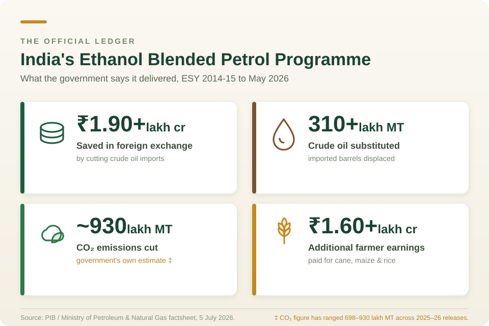

```{r setup, include=FALSE}
knitr::opts_chunk$set(echo = FALSE, warning = FALSE, message = FALSE)
library(tidyverse)
# Data files accompanying this post:
#   ethanol_blending_trajectory.csv
#   ethanol_water_footprint.csv
#   ethanol_ghg_intensity.csv
#   maize_ethanol_story.csv
#   feedstock_share_e20.csv
#   import_offset_scale.csv
```

# Background

I am a student of agricultural sciences and my fraternity had always dreamed of developing a plant-based fossil-fuel alternative — bio-fuels. In theory, the plants contributing to bio-fuel have to meet some criteria: they should not be derived from crops meant for human or animal consumption, ideally should be a by-product with little to no food value, the plants should not encroach upon cultivable fertile land, and plants should not have heavy water requirement. In summary, the bio-fuel production should not impact food security and strain freshwater sources.

In early 2000s India began experimenting with [*Jatropha curcas* seed oil to produce biodiesel](https://en.wikipedia.org/wiki/Jatropha_biodiesel_in_India# "Wikipedia page"). Jatropha isn't consumed by humans and can grow in slightly arid and harsh conditions. It seemed to meet the basic requirements; however, the project failed. More about it towards the end of the blog. Let us jump straight to ethanol first.

Recently ethanol is in news for replacing 20% petrol in our fuel tanks (E20). In 2025, two documents of the Government of India described the same ethanol policy.

The first, [a press release](https://www.pib.gov.in/PressReleasePage.aspx?PRID=2155558&reg=48&lang=2) from the Ministry of Petroleum and Natural Gas, announced that India had achieved 20 % ethanol blending in petrol — five years ahead of schedule — and tallied the winnings: lakhs of crores in foreign exchange saved, lakhs of crores paid to farmers, crores of tonnes of carbon dioxide avoided. A policy triumph.

The second, NITIAayog's [the Economic Survey 2025-26](https://www.indiabudget.gov.in/economicsurvey/doc/eschapter/echap06.pdf), described "an emerging tension between Aatmanirbharta in energy and Aatmanirbharta in food," warned that farmers were abandoning pulses and oilseeds for maize, and called the trend an early warning signal.

Both are true. This post is an attempt to hold them together.

I want to be clear at the outset about what this is not. It is not an argument that ethanol blending was a mistake. India imports about 85 to 88 % of its crude oil, and a country in that position is entitled to try almost anything. Nor is it a repetition of the viral claim that a litre of ethanol costs ten thousand litres of water — a number that is true for one feedstock and badly misleading for the others, as we will see.

It is an attempt to do the accounting properly. Every litre of ethanol in an Indian petrol tank came from somewhere: from cane, from maize, from rice out of the Food Corporation of India's godowns. This blog dwells on the question of what our food system can and cannot absorb. E20 is a very large withdrawal from that system, and it deserves a balance sheet rather than a press release. Though this blog doesn't guarantee to be a detailed balance sheet, it is an attempt to clear some haze and contribute to the sane discussion over the topic.

Let's dive into some data.

# What India actually achieved

The scale of the india's ethanol blending ramp-up is genuinely remarkable, and it would be dishonest to open with the negative criticisms.

```{r}
#| label: blending_pct
#| include: false

library(tidyverse)
library(ggtext)
library(showtext)


# Import fonts
# First argument = google name, 
# Secont name = font name in R
font_add_google('Roboto Mono', 'r_m')
font_add_google('Noto Sans', 'noto')
font_add_google('Bangers', 'Bangers')

showtext_auto()

source("C:\\R projects\\blog\\custom_theme.R")

theme_set(theme_custom_styled())

blending_pct <- tribble(
  ~yr,       ~blending_pct, ~qty_crore_l, ~comment,
  "2013-14",          1.53,         38.0, "Baseline",
  "2014-15",          2.33,         67.4, NA,
  "2015-16",          3.51,        111.4, NA,
  "2016-17",          2.07,         66.5, "Drought hits cane; blending falls",
  "2017-18",          4.22,        150.5, NA,
  "2018-19",          5.00,        188.6, NA,
  "2019-20",          5.00,        173.0, NA,
  "2020-21",          8.17,        332.0, NA,
  "2021-22",         10.02,        408.0, "10% milestone",
  "2022-23",         12.06,        502.0, NA,
  "2023-24",         14.60,        707.4, NA,
  "2024-25",         19.24,        904.0, "E20 procurement year",
  "2025-26",         20.00,       1200.0, "E20 achieved March 2025"
)
```

::: {#fig-blending}
```{r}
#| label: fig-blending
#| echo: false
#| message: false
#| warning: false
#| fig-cap: "Ethanol Blending in Indian petrol, 2013-14 to 2024-25"
ggplot(blending_pct, aes(x = yr, y = blending_pct, group = 1)) +
  geom_hline(yintercept = 20, linetype = "dashed",
             colour = "grey60", linewidth = 0.4) +
  geom_line(colour = "#2c7a4b", linewidth = 0.9) +
  geom_point(colour = "#2c7a4b", size = 2.4) +
  scale_y_continuous(labels = scales::label_percent(scale = 1),
                     limits = c(0, 22),
                     breaks = seq(0, 20, 5)) +
  labs(
    title = "India reached E20 five years ahead of target",
    subtitle = "Ethanol blending in petrol, by ethanol supply year (Nov-Oct)",
    x = NULL, y = "Blending rate",
    caption = "Source: PIB / MoP&NG; NITI Aayog"
  )  + 
  annotate(geom = "text", label = "Monsoon Failure", x = '2015-16',
           y = 6, colour = 'maroon',
           family = 'r_m', size = 8) +
  annotate(geom = "curve", x = '2015-16', y = 5, xend = '2016-17', yend = 2.1,
           colour = "maroon", curvature = -0.3, linewidth = 0.8, arrow = arrow(length = unit(0.03, "npc"))) +
  annotate(geom = "text", label = "10% Milestone", x = '2018-19', y = 10, size = 8, colour = 'maroon') +
  annotate(geom = "curve", x = '2019-20', y =10, xend = '2021-22', yend = 10.1,
           colour = "maroon", curvature = -0.3, linewidth = 0.8, arrow = arrow(length = unit(0.03, "npc"))) +
  annotate(geom = "text", label = "E20 Milestone", x = '2024-25', y = 21, size = 8, colour = 'maroon') +
  # annotate(geom = "curve", x = '2019-20', y =9, xend = '2021-22', yend = 10.1,
  #          colour = "maroon", curvature = -0.3, linewidth = 0.8, arrow = arrow(length = unit(0.03, "npc"))) +
  theme(axis.text.x = element_text(angle = 90))
```
:::

Blending rose from 1.53 % in 2013-14 to roughly 19 to 20 % by the 2024-25 ethanol supply year (@fig-blending). Volumes supplied to oil marketing companies went from 38 crore litres to somewhere between 900 and 1,016 crore litres over the same period — a factor of about twenty-five (@fig-ethanol) . Very few Indian industrial programmes have scaled like that. Since April 2026, E20 is the base grade: essentially all petrol sold in the country carries 20 % ethanol at a minimum octane rating of 95.

```{r}
#| label: ethanol_volume
#| include: false


ethanol_data <- tribble(
  ~ESY,       ~Volume_crore_litres, ~Blending_percent,
  "2012-13",  15.40,                0.67,
  "2013-14",  38.00,                1.50,
  "2014-15",  66.50,                1.14,
  "2015-16", 111.40,                3.51,
  "2016-17",  66.00,                2.07,
  "2017-18", 150.00,                4.22,
  "2018-19", 188.50,                5.00,
  "2019-20", 190.00,                5.00,
  "2020-21", 302.40,                8.10,
  "2021-22", 408.09,               10.02,
  "2022-23", 506.40,               12.06,
  "2023-24", 672.58,               14.60,
  "2024-25", 904.85,               19.17,
  "2025-26",1048.10,               20.00
)

```

```{r}
#| label: fig-ethanol
#| echo: false
#| message: false
#| error: false
#| warning: false
#| fig-cap: Ethanol Volume (in crore litres) used in blending of petrol, 2013-14 to 2024-25

ggplot(ethanol_data, aes(x = ESY, y = Volume_crore_litres, group = 1)) +
geom_col()+
  scale_y_continuous(limits = c(0, 1060),
                     breaks = seq(0, 1060, 100)) +
  labs(
    title = "Ethanol Volume increased about 25% in just 13 years",
    x = NULL, y = "Volume (crore litres)",
    caption = "Source: PIB / MoP&NG"
  )  + 
  # annotate(geom = "text", label = "Monsoon Failure", x = '2015-16',
  #          y = 6, colour = 'maroon',
  #          family = 'r_m', size = 8) +
  # annotate(geom = "curve", x = '2015-16', y = 5, xend = '2016-17', yend = 2.1,
  #          colour = "maroon", curvature = -0.3, linewidth = 0.8, arrow = arrow(length = unit(0.03, "npc"))) +
  # annotate(geom = "text", label = "10% Milestone", x = '2018-19', y = 10, size = 8, colour = 'maroon') +
  # annotate(geom = "curve", x = '2019-20', y =10, xend = '2021-22', yend = 10.1,
  #          colour = "maroon", curvature = -0.3, linewidth = 0.8, arrow = arrow(length = unit(0.03, "npc"))) +
  # annotate(geom = "text", label = "E20 Milestone", x = '2024-25', y = 21, size = 8, colour = 'maroon') +
  # annotate(geom = "curve", x = '2019-20', y =9, xend = '2021-22', yend = 10.1,
  #          colour = "maroon", curvature = -0.3, linewidth = 0.8, arrow = arrow(length = unit(0.03, "npc"))) +
  theme(axis.text.x = element_text(angle = 90))
```

The official ledger, as of the [most recent government factsheets](https://static.pib.gov.in/WriteReadData/specificdocs/documents/2026/jul/doc202675912001.pdf), reads roughly as follows. About ₹1.90 lakh crore in foreign exchange saved between 2014-15 and May 2026, by substituting some 310 lakh metric tonnes of imported crude. Over ₹1.6 lakh crore paid to farmers. Somewhere between 790 and 930 lakh metric tonnes of carbon dioxide avoided. Sugar mills, chronically unable to pay cane arrears, got a second revenue stream. Distilleries created rural jobs in Uttar Pradesh, Maharashtra and Bihar @fig-ledge.

{#fig-ledge fig-align="center"}

These are real achievements and I do not want to explain them away. But each of the three big claims — forex, carbon, and the implicit claim that this was all costless to the food system — is smaller or more complicated than it first appears.

# Claim one: the import bill

Critics often dismiss petrol blending because diesel dominates India’s transport sector. However, analyzing the hard data reveals a different reality.

NITI Aayog's 2021 roadmap put the annual saving from a fully successful E20 programme at about US\$ 4 billion. Based on multiple PIB reports, and replies in Lok Sabha the cumulative savings from ethanol blending can be pegged at ₹1.98 lakh crores. For ESY 2023-24 (Nov 2023–Oct 2024), the government reported a single-year forex saving of ₹28,400 crore, per Minister of State Suresh Gopi's written reply in the Rajya Sabha. Considering ₹ 83 per USD in ESY 2023-24, the savings amount to approx US\$ 3.4 billion. As per the latest data and an exchange rate of about ₹ 90, the savings are approx US\$ 6-7 billion – much above NITI aayog's estimates.

So, with blending ethanol India prevented about US\$ 7 billion from flowing out of the country. Since [India's oil import bill](https://www.financialexpress.com/policy/economy-crude-oil-imports-bill-up-2-7-to-137-billion-in-fy25-3814138/) in FY 2024-25 was roughly US\$137 billion, the saving may just appear `r round((7/137)*100, 2)` % of the total crude oil import bill. However, this amount is massive for India. This amount matches individual annual allocations for various programs like Jal Jeevan Mission, PM Upskilling and Employability scheme, central government's annual share for all ongoing metro rail projects in tier-1 and tier-2 cities, or to complete about 5000 km of world class 4-lane national highways.

::: {#fig-offset}
```{r fig-offset}
#| eval: false
#| include: false
library(ggsketch)
library(tidyverse)

import_offest <- tribble(~item,    ~amount,
                         "Import", 137,
                         "Saved", 7)

ggplot(data = import_offest, aes(x = "Total", y = amount, fill = item)) +
  ggsketch::geom_sketch_col(position = "stack",
                            fill_style = "watercolor",
                            width = 0.25) + coord_flip() +
  theme_void()

  
```

Annual forex saving from E20 against India's total oil import bill
:::

Four billion against one hundred and thirty-seven is about three per cent. That is not nothing — three per cent of an import bill that size is real money, and it is money that does not leave the country. But it is a very long way from the energy independence the programme is often described as delivering. If the objective is to stop being at the mercy of the crude market, E20 moves the needle by roughly the width of a month's price volatility.

There is a sharper version of this problem. As sugarcane and rice surpluses tightened, the government raised the administered price for maize-based ethanol to pull maize into distilleries. It worked. It also helped push India from being a maize exporter to a **net importer of maize in 2024**, with exports collapsing from about 1.9 million tonnes a year to around 0.5 million. Analysts at the Observer Research Foundation have called this a self-goal, and the phrase is hard to argue with: a programme justified by import substitution has generated a new import dependency, and by nudging farmers away from oilseeds it risks deepening an old one. India already imports well over half its edible oil.

# Claim two: the carbon

This is where I expected, before doing the reading, to find the strongest case for the programme. The picture is more equivocal.

Lifecycle or "well-to-wheel" analyses generally put grain and sugar ethanol at 30 to 50 per cent lower greenhouse gas emissions than petrol. Argonne National Laboratory's much-cited figure for US corn ethanol is around 40 per cent. So the direction of the effect is not in doubt.

Three things shrink it in the Indian case.

**First, the distillery's own energy.** Estimates for India put ethanol's carbon intensity at roughly 50 gCO₂e per megajoule where the distillery runs on biomass, and around 70 where it runs on coal. A great many Indian distilleries run on coal. A programme whose climate benefit is advertised as a headline is quietly being delivered at the bottom of its own range.

::: {#fig-ghg}
```{r fig-ghg}
#| eval: false
#| include: false
# read_csv("data/ethanol_ghg_intensity.csv") |>
#   ggplot(aes(fuel_pathway)) +
#   geom_linerange(aes(ymin = gco2e_per_mj_low, ymax = gco2e_per_mj_high), linewidth = 4) +
#   coord_flip() + labs(x = NULL, y = "gCO2e / MJ")
```

Carbon intensity of petrol against coal-fired and biomass-fired ethanol pathways
:::

**Second, land-use change.** The carbon accounting above generally excludes what happens when cane or maize expands onto land that was previously storing carbon. If the crop displaces forest, grassland or fallow, the soil and biomass carbon released can take years or decades to repay. Indian lifecycle studies that include land-use change are scarce, which is itself worth saying out loud: we are running a national fuel programme on emissions estimates that omit one of the largest terms.

**Third, and least intuitively, blending dilutes the benefit.** Pure ethanol can save up to about 87 per cent of emissions per megajoule against petrol. A 20 per cent blend cannot save 20 per cent of that, because the other 80 per cent of the tank is still petrol and because ethanol carries about 30 per cent less energy per litre — so you burn slightly more of it. The net saving on the blend is real but modest.

Set against a claimed 790 to 930 lakh tonnes of carbon dioxide avoided, the honest statement is: some meaningful fraction of that, depending on how the distillery is powered and where the crop was grown, neither of which the headline figure discloses.

# Claim three: the water

This is the argument that has travelled furthest on social media, usually in its least defensible form. Let me try to separate the signal.

The viral claim is that a litre of ethanol takes ten thousand litres of water. That figure is **approximately right for rice** and **wrong for sugarcane**, which supplies most of India's ethanol. Rice is the outlier for a specific and unglamorous reason: conversion efficiency. A tonne of rice yields only around 450 litres of ethanol, so rice's already large field water requirement gets divided by a small number.

::: {#fig-water}
```{r fig-water}
#| eval: false
#| include: false
# read_csv("data/ethanol_water_footprint.csv") |>
#   ggplot(aes(reorder(paste(feedstock, method), litres_water_per_litre_ethanol),
#              litres_water_per_litre_ethanol, fill = feedstock)) +
#   geom_col() + coord_flip() +
#   labs(x = NULL, y = "Litres of water per litre of ethanol")
```

Water footprint per litre of ethanol by feedstock. Estimates vary widely by method and irrigation regime; the bars should be read as a range, not a measurement.
:::

For sugarcane the credible range runs from about 1,634 litres per litre under drip irrigation to roughly 3,000, depending on whose method you accept. NITI Aayog's roadmap uses 2,860. An industry-backed ISMA-ICAR study published in 2026 argues for the lower end and makes a fair point that deserves acknowledgement: measured per unit of biomass output, cane is not obviously the villain it is made out to be. Maize sits somewhere between 4,500 and 5,600.

Three caveats keep this from being a clean win for either side.

**Allocation matters.** Ethanol made from molasses shares cane's water footprint with sugar. Ethanol made from direct cane juice carries the whole burden. Studies that do not say which route they are costing are not saying very much.

**Green water is not blue water.** A footprint that is mostly rainfall is a different proposition from one that is mostly pumped groundwater. The headline litres-per-litre number collapses this distinction, and it is the distinction that matters.

**Above all, geography matters more than the ratio.** India's ethanol capacity — of the order of 1,700 to 1,800 crore litres — is concentrated in Maharashtra, Uttar Pradesh and Karnataka for cane, and draws on paddy from Punjab and Haryana. The Central Ground Water Board's 2025 assessment classifies a great many blocks in exactly these states as over-exploited or critical. Distilleries are sited near feedstock for obvious logistical reasons, which means the industrial water demand lands on top of the agricultural water demand in the same aquifer. A litre of ethanol at 2,000 litres of water in a rainfed basin and a litre at 2,000 litres in an over-exploited block in Marathwada are not the same litre.

There is also a downstream problem that rarely makes the debate. Distilleries generate vinasse, or spent wash — a high-BOD effluent that contaminates surface and groundwater where treatment is inadequate. The water cost of ethanol is not only water withdrawn. It is also water spoiled.

# Claim four, unstated: that none of this came out of the food system

Here is where this blog's usual concerns bite hardest.

The programme's defenders have a genuinely good answer to the food-versus-fuel charge, and it is worth stating in its strongest form before taking it apart. Ethanol, they say, is made from molasses — the residue left after sugar has been extracted. It is made from *surplus* rice that the FCI cannot otherwise move. It is made from maize that farmers were happy to be paid more for. Nobody's meal was taken.

That answer was largely true in 2015. It is much less true at E20, and the reason is arithmetic.

## A ladder, not a binary

Feedstocks are not equally food-competitive. They sit on a gradient:

| Feedstock         | Competition with food                   |
|-------------------|-----------------------------------------|
| C-heavy molasses  | Genuine byproduct — close to zero       |
| B-heavy molasses  | Sugar forgone at the margin             |
| Direct cane juice | Full diversion of a food crop           |
| Maize             | Direct competition with feed and food   |
| FCI rice          | A human staple, taken from buffer stock |

E20 required on the order of 1,000 crore litres of ethanol a year. Molasses alone could never supply that. So the programme climbed the ladder — not out of ideology, but because volume forced it. Each rung was a rational response to a shortfall on the rung below. The result is a feedstock mix that now draws directly on human food, and that will draw more of it at E25 and E30.

::: {#fig-feedstock}
```{r fig-feedstock}
#| eval: false
#| include: false
# read_csv("data/feedstock_share_e20.csv") |>
#   ggplot(aes(x = "", y = share_percent_of_e20_demand, fill = feedstock_group)) +
#   geom_col(width = 1) + coord_polar("y") + theme_void()
```

Planned feedstock split for E20 demand: roughly 54 per cent from sugarcane derivatives, 46 per cent from grains
:::

## What a litre of ethanol costs, in calories

NITI Aayog's own conversion factors let us do this directly. One litre of ethanol requires about 2.3 kg of rice, or about 2.6 kg of maize.

At roughly 3,450 kcal per kg for milled rice and 3,650 for maize, and taking 2,200 kcal as a reference adult's daily requirement:

- One litre of ethanol from rice embodies about **7,900 kcal — around 3.6 adult-days of food**.
- One litre from maize embodies about **9,500 kcal — around 4.3 adult-days**.

Scale that up. The government allocated 52 lakh metric tonnes of surplus FCI rice for ethanol across the 2024-25 and 2025-26 supply years. That is 5.2 million tonnes of milled rice, carrying roughly 1.79 × 10¹³ kilocalories — enough, on paper, to meet the annual calorie requirement of about **22 million people**. It yields somewhere around 226 crore litres of ethanol.

Two honest qualifications, because this number is easy to misuse.

The first is that a meaningful share of the grain comes back. Distillers' dried grains with solubles, or DDGS, is a protein-rich co-product — around 28 to 30 per cent protein from maize, about 45 per cent from rice — that returns to the animal feed chain at ₹16,000 to ₹19,000 a tonne against ₹31,000-odd for soy de-oiled cake. Netting a rough one-third mass recovery, the figure falls to something like 15 million person-years. Any analysis that ignores DDGS is overstating the loss.

The second is more important. **This is opportunity cost, not hunger caused.** That rice was genuinely beyond what the public distribution system was lifting. No one was denied a ration so that a car could run. Presenting it otherwise would be dishonest.

But then we should ask what "surplus" is actually measuring.

## The word "surplus" is doing a great deal of work

India's rice surplus is not a gift of nature. It is manufactured — by minimum support prices, assured procurement, and near-free electricity for tubewells in Punjab and Haryana. It is, quite precisely, a surplus produced by mining groundwater that the region cannot spare. The readers of this blog will remember what that looks like from the other end.

Routing that surplus into fuel does something subtle and, I think, genuinely harmful. It converts an embarrassing overproduction problem into a celebrated energy achievement. It gives the distortion a purpose. Where the accumulation of unwanted rice was once an argument for crop diversification in the north-west, it is now feedstock security for a national fuel programme — and a constituency has grown up around keeping it.

The surplus is not evidence that the water was available to spare. It is evidence that we priced the water at zero.

## Maize: the sharper case

Rice at least has a surplus story. Maize does not.

Maize going into ethanol rose from roughly 1 million tonnes in 2022 to about 6 million in 2024, and was projected near 11 million by the end of 2025. Ethanol now takes something like a third of India's maize crop. Poultry takes about 60 per cent. The two are bidding against each other, and the price shows it: maize moved from ₹14,000-15,000 a tonne to ₹24,000-25,000 in roughly four years.

::: {#fig-maize}
```{r fig-maize}
#| eval: false
#| include: false
# read_csv("data/maize_ethanol_story.csv") |>
#   ggplot(aes(year)) +
#   geom_col(aes(y = maize_to_ethanol_mt)) +
#   geom_line(aes(y = maize_price_rs_per_tonne / 2500, group = 1)) +
#   scale_y_continuous(name = "Maize to ethanol (Mt)",
#                      sec.axis = sec_axis(~ . * 2500, name = "Price (Rs/tonne)"))
```

Maize diverted to ethanol against maize prices. India became a net importer in 2024.
:::

This is not absorbing a glut. This is manufacturing demand for a crop that was already fully spoken for, and then importing the difference.

And the loss does not show up as missing calories. It shows up as **dearer eggs, chicken and milk** — which in a country with a protein-quality problem rather than a calorie problem is arguably the worse outcome. Small poultry producers, squeezed between feed costs they cannot control and egg prices set by the market, absorb it first. Their customers absorb it next. The people who eat two eggs a week because that is what they can afford are the last link in a chain that starts at a petrol pump.

## The deepest cut: pulses and oilseeds

The Economic Survey's warning was not really about maize. It was about what maize displaces.

Between FY22 and FY25, the administered price of maize-based ethanol rose at a compound annual rate of 11.7 per cent — considerably faster than ethanol from rice or molasses. That is a deliberate price signal, and farmers responded to it rationally by moving area into maize.

They moved it out of pulses and oilseeds.

Those are precisely the two crops India can least afford to lose. Pulses are the backbone of vegetarian protein for most of the country. Edible oil is already an import dependency of well over half of consumption, and one of the most reliable sources of food-price inflation we have. A policy that pulls land away from both, in order to make a fuel that offsets three per cent of the oil bill, is not obviously a good trade — and it is a trade being made one farmer's sowing decision at a time, invisibly, with no mechanism to reverse it.

# An older lesson: whatever happened to Jatropha?

Readers with longer memories will recall that this is India's second national biofuel push, and that the first one had exactly the opposite design.

From 2003, the Planning Commission targeted 20 per cent biodiesel blending by 2011-12 using *Jatropha curcas*, to be grown on 11.2 to 13.4 million hectares of "wasteland." The entire premise was that it would never compete with food: a hardy, non-edible shrub on land nobody was farming.

It failed almost completely. By 2008 barely 700,000 hectares had been planted, yields came in at 1 to 2 tonnes a hectare against projections of 5 to 6, and the mission was effectively abandoned that August. A second attempt through the National Biodiesel Mission of 2009 — targeting 20 per cent by 2017, with procurement from 2014 and pilots from 2015 — ran aground on a simple shortage of seed. Biodiesel blending in India today sits well under one per cent.

Why it failed is the interesting part, and there are three reasons, all of which should sound familiar.

The wasteland premise was wrong: Jatropha *survives* on marginal land but does not *yield* there. Getting commercial yields required irrigation and fertiliser — which is to say, the good land the scheme existed to avoid. Deployment ran far ahead of the agronomy, with plantations going in on undomesticated germplasm and no breeding programme behind them. And smallholders carried the risk through a three-to-five year gestation, only to find no buyer at the end; large tracts allocated to companies that never followed through generated land-grab concerns that helped bury the mission quietly.

Now set the two programmes side by side.

**Jatropha failed because it refused to compete with food, land and water. Ethanol succeeded because it did.** It piggybacked on cane that was already grown, mills that already existed, distilleries that were already built, and a farm constituency already organised to lobby for it. That is the whole explanation for the difference in outcomes.

Which leads to the uncomfortable conclusion of this post. The food, water and land costs documented above are not an unfortunate side-effect of India's ethanol success. They are the mechanism of it. The programme worked *because* it drew on the food system. That is what made it fast.

# What follows from this

None of this argues for reversing E20. The capacity is built, the vehicles are certified, the supply chains exist, and there is a real if modest forex and carbon benefit. Unwinding it would waste more than it saved.

It does argue for a much more careful E25 and E30. Some things that would help:

**Publish the full public cost.** As CEEW has pointed out, what oil marketing companies pay for ethanol is not what the programme costs. Add interest subvention, guaranteed pricing, GST concessions and the implicit subsidy in cheap FCI grain, and the number is considerably larger. It should be published annually. We cannot evaluate a trade-off we have not costed.

**Price feedstocks by water and food risk, not just by volume.** Right now the administered price structure rewards whatever closes the supply gap. It should discriminate against grain from over-exploited blocks and in favour of C-heavy molasses, cane from assured-rainfall regions, and genuinely surplus stock.

**Audit water at the block level, not the national level.** A national litres-per-litre figure is close to meaningless. Overlay distillery capacity on the Central Ground Water Board's assessment and license accordingly. A distillery in an over-exploited block should have to justify itself.

**Move on 2G ethanol seriously.** Cellulosic ethanol from crop residue — paddy straw above all — is the one pathway that improves food security, air quality and emissions simultaneously. It has been five years of pilots and viability gap funding. It needs to become the default rather than the demonstration.

**Plan capacity against declining petrol demand.** CEEW's warning here is sharp: as electric vehicles take share, petrol demand will peak and fall. Capacity built today for E30 may end up as stranded assets that nonetheless keep a permanent claim on grain and groundwater — a food security cost with no remaining energy security benefit.

**Set a floor the programme cannot cross.** No FCI grain to ethanol below a defined buffer threshold. Readers of the wheat post will know how quickly a comfortable stockpile becomes an uncomfortable one after two bad seasons.

India was right to want to burn less imported crude. The question was never whether to do it, but what to burn instead — and we have answered that question, twice now, by looking at what was easiest to reach rather than what we could most afford to lose. Jatropha was hard and failed. Ethanol was easy and worked. Neither outcome tells us it was the right thing to grow.

------------------------------------------------------------------------

#### A note on the numbers

Government cumulative figures for forex savings, farmer payments and carbon avoided are revised with almost every press release; where I have quoted them I have tried to indicate the vintage. Water and lifecycle emissions figures are strongly method-dependent, and I have given ranges rather than point estimates wherever the literature does not agree. The calorie calculations are my own, using NITI Aayog's conversion factors and standard composition tables; they are illustrative of opportunity cost and should not be read as a claim about observed hunger. Corrections are welcome.

## References

Central Ground Water Board. 2025. *Dynamic Ground Water Resources of India.*

Council on Energy, Environment and Water (CEEW). 2026. *After E20: India's Ethanol Blending Programme Next Phase.*

Down To Earth. 2025. "Lost in maize." June 16-30 print edition.

Down To Earth. 2026. "Fuel over food? Economic Survey 2026 flags early warning signs of ethanol reshaping crop priorities."

Gerbens-Leenes, P.W., and A.Y. Hoekstra. *The Water Footprint of Sweeteners and Bio-ethanol.* Value of Water Research Report Series No. 38, UNESCO-IHE.

Government of India. 2026. *Economic Survey 2025-26.*

Indian Sugar and Bio-energy Manufacturers Association (ISMA) and ICAR. 2026. *Water use efficiency in sugarcane and competing crops.*

NITI Aayog and Ministry of Petroleum and Natural Gas. 2021. *Roadmap for Ethanol Blending in India 2020-25.* New Delhi.

Observer Research Foundation. "Ethanol blended petrol for energy security: India's self-goal?"

Press Information Bureau, Ministry of Petroleum and Natural Gas. 2025-2026. Ethanol Blended Petrol Programme factsheets.

Saini, S., P. Khatri, and S. Hussain. *Ethanol Blending of Petrol in India.* Arcus Policy Research.

USDA Foreign Agricultural Service. 2025. *Grain and Feed Annual: India.* GAIN Report IN2025-0023.

Wang, M., et al. Argonne National Laboratory GREET model — lifecycle analysis of ethanol pathways.

*\[Add DOIs for the peer-reviewed sources — the ScienceDirect papers on Jatropha policy (Energy Policy, 2011 and 2012) and the 2020 Environmental Research Letters paper on the water-food-energy nexus in the Indian sugar industry are worth citing directly.\]*

```{r}
getwd()
```
